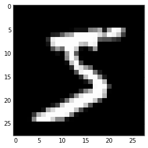

## MNIST 데이터셋 및 LMDB 준비

이번에는 MNIST 데이터셋 및 LMDB에 대해서 알아봅니다. MNIST 데이터는 기계학습에서 대표적으로 많이 사용되는 벤치마킹 데이터입니다.
28 0에서부터 9까지 10가지의 손글씨 이미지가 있는데요. 이미지 크기는 28x28, 트레이닝 이미지는 60,000장, 테스트 이미지는
10,000장으로 이루어져 있습니다. 자세한 내용은 MNIST [공식 페이지](http://yann.lecun.com/exdb/mnist/
)를 참고하세요.

이번 시간에는 Caffe에서 사용하는 LMDB포멧을 이용하여 MNIST 데이터를 읽어보고 python을 이용하여 시각화를 해보도록 하겠습니다.

### MNIST 데이터셋 다운로드

카페 소스에는 여러가지 유용한 툴들을 제공학 있는데요. 그 중의 하나가 데이터셋을 다운로드 받아서 LMDB로 변환하는 작업입니다. 먼저 아래와
같이 카페의 홈폴더(여기서는 `your_caffe_home` 이라 하겠습니다.) 아래에 있는 mnist 폴더로 이동해서 `get_mnist`
합니다.

```
cd your_caffe_home/data/mnist
./get_mnist.sh
```

폴더 안에 4개 파일 (t10k-images-idx3-ubyte, t10k-labels-idx1-ubyte, train-images-
idx3-ubyte,
train-labels-idx1-ubyte) 이 다운로드 된것을 확인할 수 있습니다.

### LMDB 변환

이번에는 LMDB 파일로 변환해 보도록 하겠습니다. 변환 툴은 홈폴더 아래에 있는 examples/mnist 폴더 안에 있습니다. 한번 실행해
보죠.

```
cd your_caffe_home
sh examples/mnist/create_mnist.sh
```

그럼 두 개의 폴더 (mnist_test_lmdb, mnist_train_lmdb)가 생성된걸 확인할 수 있습니다. 각 폴더에는 LMDB 형태로
트레이닝 데이터와 테스트 데이터가 생성되어 있습니다. 이런 식으로 카페에서는 공식적으로 LMDB 또는 LevelDB 포멧을 데이터로 사용합니다.
임의의 데이터는 둘 중 하나의 포멧으로 변환한 후에 사용해야 하는데요. 변환하는 C++ 코드는 다음번에 한번 알아보도록 하겠습니다.

## Python code

이번에는 파이썬을 이용하여 LMDB로 변환된 MNIST 데이터셋을 읽어오고 시각화하여 데이터를 직접 살펴보도록 하겠습니다. 이 강의는 C++을 기반으로 되어 있지만, 간간히 파이썬을 유용하게 사용하려고 합니다. 처음 접하시는 분은 유용한 툴이 많으니 이번 기회에 파이썬을 한번 접해보세요. 

### LMDB 라이브러리 설치 

먼저 lmdb를 설치합니다. 자세한 설치법은 [공식사이트](https://lmdb.readthedocs.org/en/release/)를
참조하시고, 여기서는 우분투를 기반으로 코드 몇 줄만 적습니다. Python Package 관리 프로그램
[pip](https://pypi.python.org/pypi/pip)이 없으신 분들은 먼저 설치하시기 바랍니다.

```
apt-get install libffi-dev python-dev build-essential
pip install lmdb
```

### Python code

이제부터 본격적인 파이썬 코딩을 합니다. 선호하시는 파이썬 에디터를 열어서 아래 코드들을 차례로 실행해보세요. 저는 개인적으로 [ipython
notebook](http://ipython.org/notebook.html)을 선호합니다. 이 강좌도 IP notebook을 이용하여
작성하였습니다.

LMDB 및 카페 파이썬 라이브러리 import


    # for ipython notebook
    %matplotlib inline  
    your_caffe_home = '/home/koosy/caffe/caffe'   # example
    
    import numpy as np
    import matplotlib.pyplot as plt
    import lmdb
    import sys
    sys.path.insert(0, your_caffe_home + 'python')
    import caffe

LMDB 데이터 셋 열기


    lmdb_train = lmdb.open(your_caffe_home + '/examples/mnist/mnist_train_lmdb', readonly=True)
    lmdb_test = lmdb.open(your_caffe_home + '/examples/mnist/mnist_test_lmdb', readonly=True)

이제, `lmdb_train`과 `lmdb_test`안에 데이터셋이 들어와 있습니다. 트레이닝 데이터에는 60,000장의 이미지와 라벨이,
테스트 데이터에는 10,000장의 이미지와 라벨이 들어 있을텐데요. 예제로 각 데이터셋의 첫번째 그리고 마지막 데이터를 접근해서 읽어보도록
하겠습니다. 접근을 위해 8바이트의 인덱스 키를 사용합니다.


    start_train = lmdb_train.begin().get('00000000')
    end_train = lmdb_train.begin().get('00059999')
    start_test = lmdb_test.begin().get('00000000')
    end_test = lmdb_test.begin().get('00009999')

이제 `start_train` 부터 `end_test` 까지는 이미지 및 라벨 정보가 들어가 있는데요. 데이터들이 LMDB에 저장될 때 사용된
규칙에 따라 일렬화된 문자열로 저장이 되어 있습니다. 각 문자열만 봐서는 무슨 정보가 들어있는지 알 수 없겠죠? 카페에서는 Datum 이라는
데이터 구조를 가지고 MNIST 데이터를 읽어서 LMDB에 저장했는데요, 카페에서 정의한 데이터 구조를 자세히 알고 싶으시면 [caffe.pro
to](https://github.com/BVLC/caffe/blob/master/src/caffe/proto/caffe.proto)를
살펴보세요. Datum 외에도 카페에서 사용하는 다른 변수 타입의 정의를 한 눈에 보실 수 있습니다.

그럼 이번에는 Datum을 이용하여 데이터를 저장해 보도록 하겠습니다. `ParseFromString` 이라는 함수로 LMDB의 문자열 데이터를
해석하고 Datum에 저장합니다.


    datum_train_start = caffe.proto.caffe_pb2.Datum()
    datum_train_start.ParseFromString(start_train)

먼저 `datum_train_start` 안에 구조가 어떻게 되어 있는지 한번 살펴볼까요? ipython에서는
`datum_train_start?` 라고 치면 데이터 안의 값 및 설명을 볼 수가 있습니다.


    datum_train_start?

channels: 1
height: 28
width: 28
data: "\000\000\000\000\000\000\000\000\000\000\000\000\000\000\ <...> 00\000\000\000\000\000\000\000\000\000\000\000\000\000\000\000\000\000\000\000\000\000"
label: 5

보시다시피 하나의 Datum은  channels, height, width, data, label 으로 이루어져 있습니다. 즉 앞의 예제에서
살펴본 blob의 구조 중에서 첫번째 차원인 numbers 를 제외한 3차원 구조 + label 데이터를 담을 수 있는데요, 실제 데이터는
1차원 스트링으로 되어있고, 차원 정보만 있음을 알 수 있습니다.

이번에는 Datum에 명시된데로(1 x 28 x 28) 데이터를 다차원 배열로 복구해 보겠습니다. numpy를 이용하여 unsigned int
타입으로 변환하고, `reshape()` 명령을 사용해서 차원 변환을 합니다.


    flat_x = np.fromstring(datum_train_start.data, dtype=np.uint8)
    x = flat_x.reshape(datum_train_start.height, datum_train_start.width)

`x`가 2차원 배열로 잘 변환이 되었나 확인해 봅시다.


    x.shape


    (28, 28)


이번에는 matplotlib.pyplot의 `imshow` 명령을 사용해서 이차원 이미지 데이터를 시각화해 봅시다. 트레이닝 데이터셋의 첫 번째
이미지는 아래 보는것과 같이 숫자 5이군요.


    plt.rcParams['image.interpolation'] = 'none'
    plt.rcParams['image.cmap'] = 'gray'
    plt.imshow(x)


    <matplotlib.image.AxesImage at 0x7fb8e8978f10>





`datum_train_start`에 저장된 라벨값도 같은지 확인해 봅시다.


    datum_train_start.label


    5


## 맺음말

이번 강좌에서는 LMDB로 변환한 MNIST 데이터셋을 파이썬으로 읽어오고, 카페 파이썬 라이브러리를 이용하여 각 데이터와 라벨을 읽고 시각화
해서 확인해 보았습니다. Datum 이라는 카페에서 사용하는 데이터구조가 데이터를 데이터베이스에 저장하거나 읽어오는 인터페이스 역할을 하는것도
알아보았습니다. 다음번에는 C++ 코드에서 각 Datum을 어떻게 Blob으로 만드는지, 그리고 이렇게 읽은 MNIST 데이터를 실제로 활용하여
머신러닝 알고리즘들을 구현해 보도록 하겠습니다.


    
